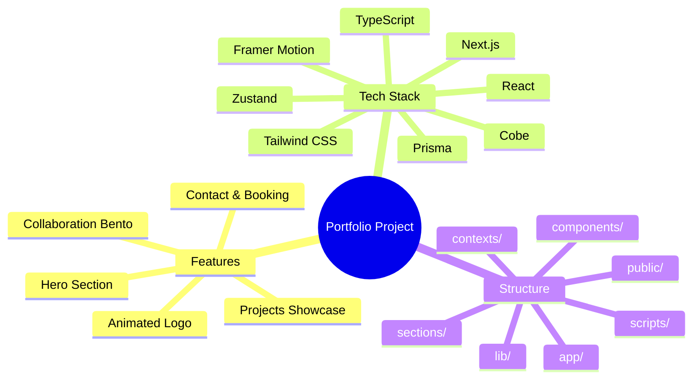

## 🧠 Mindmap



# 🚀 Vishesh Sanghvi Portfolio

This is a modern, feature-rich portfolio built with [Next.js](https://nextjs.org), [TypeScript](https://www.typescriptlang.org/), and [Tailwind CSS](https://tailwindcss.com/). It showcases projects, skills, and contact options with beautiful UI and interactive components.

## ✨ Features

- Animated hero and background sections
- Bento grid for collaboration and tech stack
- Dynamic project showcase
- Contact form and modal
- Booking integration (Cal.com)
- Custom SVG icons and assets
- Responsive, dark-themed design
- Context-based modal management

## 🛠️ Tech Stack

- Next.js 15
- React 19
- TypeScript
- Tailwind CSS
- Framer Motion
- Radix UI & Lucide Icons
- Zustand, Zod, Prisma
- Cobe (globe animation)


## Getting Started


## 🚦 Getting Started

First, install dependencies:

```bash
npm install
# or
yarn install
# or
pnpm install
# or
bun install
```

Then, run the development server:

```bash
npm run dev
# or
yarn dev
# or
pnpm dev
# or
bun dev
```


Open [http://localhost:3000](http://localhost:3000) in your browser to see the result.


You can start editing the main page by modifying `app/page.tsx`. The app auto-updates as you edit files.

## 📦 Project Structure

- `app/` — Main app pages and routing
- `components/` — UI components (animated logo, modals, bento grid, etc.)
- `contexts/` — React context providers
- `lib/` — Utility functions and data
- `public/` — Static assets (SVGs, images, manifest)
- `sections/` — Page sections (Hero, Projects, Contact, etc.)
- `scripts/` — Utility scripts

## 📬 Contact & Booking

- Use the contact form or modal to reach out
- Book a call via the booking page (`/book`)


## 🚀 Deploy

Deploy easily on [Vercel](https://vercel.com/) or your preferred platform. See [Next.js deployment docs](https://nextjs.org/docs/app/building-your-application/deploying) for details.

---

Made with ❤️ by Vishesh Sanghvi
